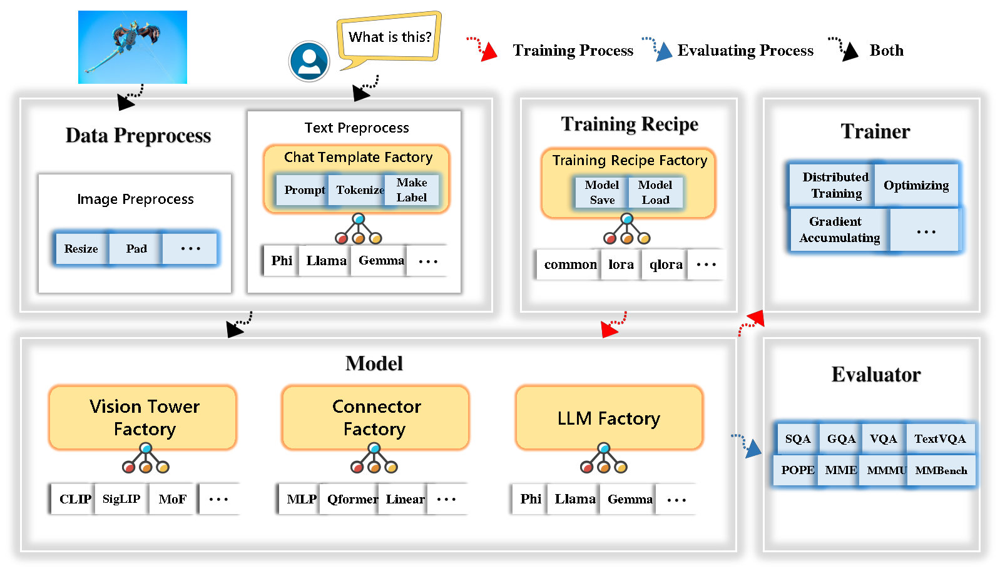

<h2 align="center"> <a href="https://arxiv.org/abs/2402.14289">TinyLLaVA Factory</a><h5 align="center">

[](https://huggingface.co/tinyllava) [](https://arxiv.org/abs/2402.14289) [](https://arxiv.org/abs/2405.11788)[](https://github.com/TinyLLaVA/TinyLLaVA_Factory/blob/main/LICENSE) [](https://tinyllava-factory.readthedocs.io/en/latest/) [](http://8843843nmph5.vicp.fun/#/)



## &#x1F389; News
* **[2024.08.13]**  A simple [visualizaiton tool](https://github.com/TinyLLaVA/TinyLLaVA_Factory/tree/main/tinyllava_visualizer) for interpreting the prediction of TinyLLaVA is added.
* **[2024.05.21]**  Our paper: [TinyLLaVA Factory: A Modularized Codebase for Small-scale Large Multimodal Models](https://arxiv.org/abs/2405.11788) is released!
* **[2024.05.15]** [TinyLLaVA Factory](https://github.com/TinyLLaVA/TinyLLaVA_Factory), our new codebase, is released!  **Note that the old codebase, TinyLLaVABench, is moved to the [tinyllava_bench](https://github.com/TinyLLaVA/TinyLLaVA_Factory/tree/tinyllava_bench) branch.**
* **[2024.05.04]**  [TinyLLaVA Demo](http://8843843nmph5.vicp.fun/#/) is released!
* **[2024.02.21]**  Our paper: [TinyLLaVA: A Framework of Small-scale Large Multimodal Models](https://arxiv.org/abs/2402.14289) is released!

## &#x1F525; Takeaways
- Our best model, [TinyLLaVA-Phi-2-SigLIP-3.1B](https://huggingface.co/tinyllava/TinyLLaVA-Phi-2-SigLIP-3.1B), achieves better overall performance against existing 7B models such as LLaVA-1.5 and Qwen-VL.

- TinyLLaVA Factory is an open-source modular codebase for small-scale large multimodal models (LMMs), implemented in PyTorch and HuggingFace, with a focus on simplicity of code implementations, extensibility of new features, and reproducibility of training results.

- With TinyLLaVA Factory, you can customize your own large multimodal models with less coding effort and less coding mistakes.

- TinyLLaVA Factory integrates a suite of cutting-edge models and methods. 

  - LLM currently supports **OpenELM**, **TinyLlama**, **StableLM**, **Qwen**, **Gemma**, and **Phi**. 

  - Vision tower currently supports **CLIP,** **SigLIP**, **Dino**, and **combination of CLIP and Dino**.
    
  - Connector currently supports **MLP**, **Qformer**, and **Resampler**.
    
  - Training Recipe currently supports **Frozen/Fully/Partially tuning** and **LoRA/QLoRA tuning**.
  
- The password to access our demo is '1234'.

## Contents

- [🎉 News](#-news)
- [🔥 Takeaways](#-takeaways)
- [Contents](#contents)
- [Installation and Requirements](#installation-and-requirements)
    - [Upgrade to the latest code base](#upgrade-to-the-latest-code-base)
- [Get Started](#get-started)
    - [1. Data Preparation](#1-data-preparation)
    - [2. Train](#2-train)
    - [3. Evaluation](#3-evaluation)
- [Model Zoo](#model-zoo)
  - [Trained Models](#trained-models)
    - [Model Performance](#model-performance)
  - [Legacy Models](#legacy-models)
- [Launch Demo Locally](#launch-demo-locally)
  - [Gradio Web Demo](#gradio-web-demo)
  - [CLI Inference](#cli-inference)
  - [Quick Inference Scripts](#quick-inference-scripts)
- [Custom Finetune](#custom-finetune)
- [Customize Your Own Large Multimodel Models](#customize-your-own-large-multimodel-models)
  - [LLM](#llm)
  - [Vision Tower](#vision-tower)
  - [Connector](#connector)
- [Acknowledgement](#acknowledgement)
- [Contact](#contact)
- [✏ Citation](#-citation)
- [❤️ Community efforts](#️-community-efforts)


## Installation and Requirements

Please note that our environment requirements are different from LLaVA's environment requirements. We strongly recommend you create the environment from scratch as follows.

1. Clone this repository and navigate to the folder
```bash
git clone https://github.com/TinyLLaVA/TinyLLaVA_Factory.git
cd TinyLLaVA_Factory
```

2. Create a conda environment, activate it and install Packages
```Shell
conda create -n tinyllava_factory python=3.10 -y
conda activate tinyllava_factory
pip install --upgrade pip  # enable PEP 660 support
pip install -e .
```

3. Install additional packages
```Shell
pip install flash-attn --no-build-isolation
```
#### Upgrade to the latest code base

```Shell
git pull
pip install -e .
```

## Get Started

#### 1. Data Preparation

Please refer to the [Data Preparation](https://tinyllava-factory.readthedocs.io/en/latest/Prepare%20Datasets.html) section in our [Documenation](https://tinyllava-factory.readthedocs.io/en/latest/).

#### 2. Train

Here's an example for training a LMM using Phi-2.

- Replace data paths with yours in `scripts/train/train_phi.sh`
- Replace `output_dir` with yours in `scripts/train/pretrain.sh`
- Replace `pretrained_model_path` and `output_dir` with yours in `scripts/train/finetune.sh`
- Adjust your GPU ids (localhost) and `per_device_train_batch_size` in `scripts/train/pretrain.sh` and `scripts/train/finetune.sh`

```bash
bash scripts/train/train_phi.sh
```

Important hyperparameters used in pretraining and finetuning are provided below.

| Training Stage | Global Batch Size | Learning rate | conv_version |
| -------------- | :---------------: | :-----------: | :----------: |
| Pretraining    | 256               | 1e-3          | pretrain     |
| Finetuning     | 128               | 2e-5          | phi          |

**Tips:** 

Global Batch Size = num of GPUs * `per_device_train_batch_size` * `gradient_accumulation_steps`, we recommand you always keep global batch size and learning rate as above except for lora tuning your model.

`conv_version` is a hyperparameter used for choosing different chat templates for different LLMs. In the pretraining stage, `conv_version` is the same for all LLMs, using `pretrain`. In the finetuning stage, we use

`phi` for Phi-2, StableLM, Qwen-1.5

`llama` for TinyLlama, OpenELM

`gemma` for Gemma

#### 3. Evaluation

Please refer to the [Evaluation](https://tinyllava-factory.readthedocs.io/en/latest/Evaluation.html) section in our [Documenation](https://tinyllava-factory.readthedocs.io/en/latest/Evaluation.html).

## Model Zoo

### Trained Models

which are trained using TinyLLaVA Factory.

- [TinyLLaVA-Phi-2-SigLIP-3.1B](https://huggingface.co/tinyllava/TinyLLaVA-Phi-2-SigLIP-3.1B)
- [TinyLLaVA-Gemma-SigLIP-2.4B](https://huggingface.co/tinyllava/TinyLLaVA-Gemma-SigLIP-2.4B)
- [TinyLLaVA-OpenELM-450M-SigLIP-0.89B](https://huggingface.co/jiajunlong/TinyLLaVA-0.89B)
- [TinyLLaVA-Qwen2-0.5B-SigLIP](https://huggingface.co/Zhang199/TinyLLaVA-Qwen2-0.5B-SigLIP)
- [TinyLLaVA-Qwen2.5-3B-SigLIP](https://huggingface.co/Zhang199/TinyLLaVA-Qwen2.5-3B-SigLIP)

#### Model Performance

| VT (HF Path)                      | LLM (HF Path)                      | Recipe    | VQA-v2 | GQA  | SQA-image | TextVQA | MM-Vet | POPE | MME    | MMMU-val |
| --------------------------------- | ---------------------------------- | --------- | :----: | :--: | :-------: | :-----: | :----: | :--: | :----: | :------: |
| openai/clip-vit-large-patch14-336 | apple/OpenELM-450M-Instruct        | base      | 69.5   | 52.1 | 50.6      | 40.4    | 20.0   | 83.6 | 1052.9 | 23.9     |
| google/siglip-so400m-patch14-384  | apple/OpenELM-450M-Instruct        | base      | 71.7   | 53.9 | 54.1      | 44.0    | 20.0   | 85.4 | 1118.8 | 24.0     |
| google/siglip-so400m-patch14-384  | Qwen/Qwen2-0.5B                    | base      | 72.3   | 55.8 | 60.1      | 45.2    | 19.5   | 86.6 | 1153.0 | 29.7     |
| google/siglip-so400m-patch14-384  | Qwen/Qwen2.5-0.5B                  | base      | 75.3   | 59.5 | 60.3      | 48.3    | 23.9   | 86.1 | 1253.0 | 33.3     |
| google/siglip-so400m-patch14-384  | Qwen/Qwen2.5-3B                    | base      | 79.4   | 62.5 | 74.1      | 58.3    | 34.8   | 87.4 | 1438.7 | 39.9     |
| openai/clip-vit-large-patch14-336 | TinyLlama/TinyLlama-1.1B-Chat-v1.0 | base      | 73.7   | 58.0 | 59.9      | 46.3    | 23.2   | 85.5 | 1284.6 | 27.9     |
| google/siglip-so400m-patch14-384  | TinyLlama/TinyLlama-1.1B-Chat-v1.0 | base      | 75.5   | 58.6 | 64.0      | 49.6    | 23.5   | 86.3 | 1256.5 | 28.3     |
| openai/clip-vit-large-patch14-336 | stabilityai/stablelm-2-zephyr-1_6b | base      | 75.9   | 59.5 | 64.6      | 50.5    | 27.3   | 86.1 | 1368.1 | 31.8     |
| google/siglip-so400m-patch14-384  | stabilityai/stablelm-2-zephyr-1_6b | base      | 78.2   | 60.7 | 66.7      | 56.0    | 29.4   | 86.3 | 1319.3 | 32.6     |
| google/siglip-so400m-patch14-384  | google/gemma-2b-it                 | base      | 78.4   | 61.6 | 64.4      | 53.6    | 26.9   | 86.4 | 1339.0 | 31.7     |
| openai/clip-vit-large-patch14-336 | microsoft/phi-2                    | base      | 76.8   | 59.4 | 71.2      | 53.4    | 31.7   | 86.8 | 1448.6 | 36.3     |
| google/siglip-so400m-patch14-384  | microsoft/phi-2                    | base      | 79.2   | 61.6 | 71.9      | 57.4    | 35.0   | 87.2 | 1462.4 | 38.2     |
| google/siglip-so400m-patch14-384  | microsoft/phi-2                    | base&lora | 77.6   | 59.7 | 71.6      | 53.8    | 33.3   | 87.9 | 1413.2 | 35.6     |
| google/siglip-so400m-patch14-384  | microsoft/phi-2                    | share     | 80.1   | 62.1 | 73.0      | 60.3    | 37.5   | 87.2 | 1466.4 | 38.4     |

### Legacy Models

which are trained using the old codebase TinyLLaVABench.

- [TinyLLaVA-3.1B](https://huggingface.co/bczhou/TinyLLaVA-3.1B)
- [TinyLLaVA-2.0B](https://huggingface.co/bczhou/TinyLLaVA-2.0B)
- [TinyLLaVA-1.5B](https://huggingface.co/bczhou/TinyLLaVA-1.5B)
- [tiny-llava-hf](https://huggingface.co/bczhou/tiny-llava-v1-hf)

If you have models trained by our old codebase TinyLLaVABench and you still want to use them, we provide an example of [TinyLLaVA-3.1B](https://huggingface.co/bczhou/TinyLLaVA-3.1B) for how to use legacy models.

<details>
<summary>Example of using legacy models</summary>


```Python
from tinyllava.eval.run_tiny_llava import eval_model
from tinyllava.model.convert_legecy_weights_to_tinyllavafactory import *

model = convert_legecy_weights_to_tinyllavafactory('bczhou/TinyLLaVA-3.1B')

prompt = "What are the things I should be cautious about when I visit here?"
image_file = "https://llava-vl.github.io/static/images/view.jpg"

args = type('Args', (), {
    "model_path": None,
    "model": model,
    "query": prompt,
    "conv_mode": "phi", # the same as conv_version in the training stage. Different LLMs have different conv_mode/conv_version, please replace it
    "image_file": image_file,
    "sep": ",",
    "temperature": 0,
    "top_p": None,
    "num_beams": 1,
    "max_new_tokens": 512
})()

eval_model(args)

"""
Output: 
When visiting this serene lakeside location with a wooden dock, there are a few things to be cautious about. First, ensure that the dock is stable and secure before stepping onto it, as it might be slippery or wet, especially if it's a wooden structure. Second, be mindful of the surrounding water, as it can be deep or have hidden obstacles, such as rocks or debris, that could pose a risk. Additionally, be aware of the weather conditions, as sudden changes in weather can make the area more dangerous. Lastly, respect the natural environment and wildlife, and avoid littering or disturbing the ecosystem.
"""
```

</details>


## Launch Demo Locally

### Gradio Web Demo
Launch a local web demo by running:
```bash
python tinyllava/serve/app.py --model-path tinyllava/TinyLLaVA-Phi-2-SigLIP-3.1B
```
### CLI Inference
We also support running inference with CLI. To use our model, run:
```bash
python -m tinyllava.serve.cli \
   --model-path tinyllava/TinyLLaVA-Phi-2-SigLIP-3.1B \
   --image-file "./tinyllava/serve/examples/extreme_ironing.jpg" 
```
### Quick Inference Scripts
If you want to launch the model trained by yourself or us locally, here's an example.
<details>
<summary>Run inference with the model trained by yourself</summary>

```Python
from tinyllava.eval.run_tiny_llava import eval_model

model_path = "/absolute/path/to/your/model/"
prompt = "What are the things I should be cautious about when I visit here?"
image_file = "https://llava-vl.github.io/static/images/view.jpg"
conv_mode = "phi" # or llama, gemma, etc

args = type('Args', (), {
    "model_path": model_path,
    "model": None,
    "query": prompt,
    "conv_mode": conv_mode,
    "image_file": image_file,
    "sep": ",",
    "temperature": 0,
    "top_p": None,
    "num_beams": 1,
    "max_new_tokens": 512
})()

eval_model(args)

"""
Output: 
XXXXXXXXXXXXXXXXX
"""
```
</details>

<details>
<summary>Run inference with the model trained by us using huggingface transformers</summary>

```Python
from transformers import AutoTokenizer, AutoModelForCausalLM

hf_path = 'tinyllava/TinyLLaVA-Phi-2-SigLIP-3.1B'
model = AutoModelForCausalLM.from_pretrained(hf_path, trust_remote_code=True)
model.cuda()
config = model.config
tokenizer = AutoTokenizer.from_pretrained(hf_path, use_fast=False, model_max_length = config.tokenizer_model_max_length,padding_side = config.tokenizer_padding_side)
prompt="What are these?"
image_url="http://images.cocodataset.org/val2017/000000039769.jpg"
output_text, genertaion_time = model.chat(prompt=prompt, image=image_url, tokenizer=tokenizer)

print('model output:', output_text)
print('runing time:', genertaion_time)
```
</details>

## Custom Finetune
If you want to finetune TinyLLaVA with your custom datasets, please refer to [here](https://github.com/TinyLLaVA/TinyLLaVA_Factory/blob/main/CUSTOM_FINETUNE.md).

## Customize Your Own Large Multimodel Models

### LLM

If you want to add a new LLM by yourself, you need to create two files: one for chat template and the other for language model, under the folders `tinyllava/data/template/` and `tinyllava/model/llm/`.

Here is an example of adding the Gemma model.

Firstly, create `tinyllava/data/template/gemma_template.py`, which will be used for the finetuning stage.

```python
from dataclasses import dataclass
from typing import TYPE_CHECKING, Dict, List, Optional, Sequence, Tuple, Union
from packaging import version

from .formatter import EmptyFormatter, StringFormatter
from .base import Template
from .formatter import Formatter
from . import register_template
from ...utils.constants import *

from transformers import PreTrainedTokenizer
import torch
import tokenizers

    
system = "A chat between a curious user and an artificial intelligence assistant. The assistant gives helpful, detailed, and polite answers to the user's questions."

@register_template('gemma') # Enable the TemplateFactory to obtain the added template by this string ('gemma').
@dataclass
class GemmaTemplate(Template):
    format_image_token: "Formatter" = StringFormatter(slot="<image>\n{{content}}")
    format_user: "Formatter" = StringFormatter(slot="USER" + ": " + "{{content}}" + " ")
    format_assistant: "Formatter" = StringFormatter(slot="ASSISTANT" + ": " + "{{content}}" + "<eos>") # to be modified according to the tokenizer you choose
    system: "Formatter" = EmptyFormatter(slot=system+" ")
    separator: "Formatter" = EmptyFormatter(slot=[' ASSISTANT: ', '<eos>']) # to be modified according to the tokenizer you choose

    def _make_masks(self, labels, tokenizer, sep, eos_token_length, rounds):
        # your code here
        return labels, cur_len
```
**Tips:**

Please ensure that the `labels` (returned by the `_make_masks` function) follows this format: answers and the eos token id are not masked, and the other tokens are masked with `-100`.

Secondly, create `tinyllava/model/llm/gemma.py`.

```python
from transformers import GemmaForCausalLM, AutoTokenizer
# The LLM you want to add along with its corresponding tokenizer.

from . import register_llm

# Add GemmaForCausalLM along with its corresponding tokenizer and handle special tokens.
@register_llm('gemma') # Enable the LLMFactory to obtain the added LLM by this string ('gemma').
def return_gemmaclass(): 
    def tokenizer_and_post_load(tokenizer):
        tokenizer.pad_token = tokenizer.unk_token
        return tokenizer
    return (GemmaForCausalLM, (AutoTokenizer, tokenizer_and_post_load))
```

Finally, create `scripts/train/train_gemma.sh` with the corresponding `LLM_VERSION` and `CONV_VERSION`.

### Vision Tower

If you want to add a new vision tower, you need to implement a new vision tower class that should be inherited from the base class `VisionTower`. Here's an example of the MoF vision tower.

First, create `tinyllava/model/vision_tower/mof.py`

```python
@register_vision_tower('mof')      
class MoFVisionTower(VisionTower):
    def __init__(self, cfg):
        super().__init__(cfg)

        self._vision_tower = MoF(cfg)
        self._image_processor = # your image processor
  
    def _load_model(self, vision_tower_name, **kwargs):
        # your code here, make sure your model can be correctly loaded from pretrained parameters either by huggingface or pytorch loading

    def forward(self, x, **kwargs):
        # your code here
```

Then, modify your training scripts with the corresponding `VT_VERSION`.

### Connector

If you want to add a new connector, you need to implement a new connector class that should be inherited from the base class `Connector`. Here's an example of the Linear connector.

First, create `tinyllava/model/connector/linear.py`


```python
import torch.nn as nn

from . import register_connector
from .base import Connector
    
@register_connector('linear') #Enable the ConnectorMFactory to obtain the added connector by this string ('linear').     
class LinearConnector(Connector):
    def __init__(self, config):
        super().__init__()
        self._connector =  nn.Linear(config.vision_hidden_size, config.hidden_size) # define your connector model
```

Then, modify your training scripts with the corresponding `CN_VERSION`.

## Acknowledgement
We give special thanks to Lei Zhao, Luche Wang, Kaijun Luo, and Junchen Wang for building the [Demo](http://8843843nmph5.vicp.fun/#/).

## Contact
If you have any questions, feel free to either initiate an *Issue* or contact us by WeChat (WeChatID: *TinyLLaVA*).

## &#x270F; Citation

If you find our paper and code useful in your research, please consider giving a star :star: and citation :pencil:.

```BibTeX
@misc{zhou2024tinyllava,
      title={TinyLLaVA: A Framework of Small-scale Large Multimodal Models}, 
      author={Baichuan Zhou and Ying Hu and Xi Weng and Junlong Jia and Jie Luo and Xien Liu and Ji Wu and Lei Huang},
      year={2024},
      eprint={2402.14289},
      archivePrefix={arXiv},
      primaryClass={cs.LG}
}
```
```BibTeX
@article{jia2024tinyllava,
  title={TinyLLaVA Factory: A Modularized Codebase for Small-scale Large Multimodal Models},
  author={Jia, Junlong and Hu, Ying and Weng, Xi and Shi, Yiming and Li, Miao and Zhang, Xingjian and Zhou, Baichuan and Liu, Ziyu and Luo, Jie and Huang, Lei and Wu, Ji},
  journal={arXiv preprint arXiv:2405.11788},
  year={2024}
}
```


## ❤️ Community efforts
* Our codebase is built upon the [LLaVA](https://github.com/haotian-liu/LLaVA) project. Great work!
* Our project uses data from the [ShareGPT4V](https://github.com/InternLM/InternLM-XComposer/tree/main/projects/ShareGPT4V) project. Great work!
