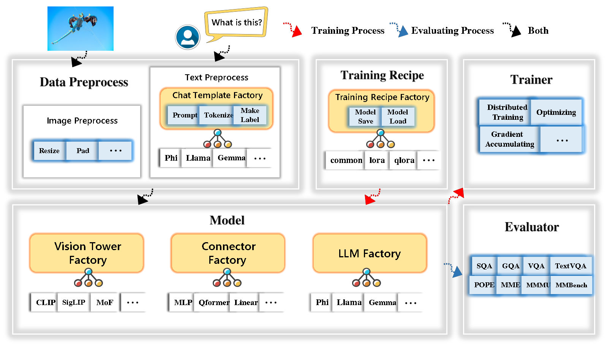

<h2 align="center"> <a href="https://arxiv.org/abs/2402.14289">TinyLLaVA Factory</a><h5 align="center">

[](https://huggingface.co/tinyllava) [](https://arxiv.org/abs/2402.14289) [](https://arxiv.org/abs/2405.11788)[](https://github.com/TinyLLaVA/TinyLLaVA_Factory/blob/main/LICENSE) [](https://tinyllava-factory.readthedocs.io/en/latest/) [](http://8843843nmph5.vicp.fun/#/)



## &#x1F389; News
* **[2025.01]**  Our new work [TinyLLaVA-Video](https://github.com/ZhangXJ199/TinyLLaVA-Video) is released.
* **[2024.08.13]** A simple visualization tool was added for the original runtime. See the [migration guide](docs/en/migration.md) for archived tools.
* **[2024.05.21]**  Our paper: [TinyLLaVA Factory: A Modularized Codebase for Small-scale Large Multimodal Models](https://arxiv.org/abs/2405.11788) is released!
* **[2024.05.15]** [TinyLLaVA Factory](https://github.com/TinyLLaVA/TinyLLaVA_Factory), our new codebase, is released!  **Note that the old codebase, TinyLLaVABench, is moved to the [tinyllava_bench](https://github.com/TinyLLaVA/TinyLLaVA_Factory/tree/tinyllava_bench) branch.**
* **[2024.05.04]**  [TinyLLaVA Demo](http://8843843nmph5.vicp.fun/#/) is released! (The password to access our demo is '1234'.)
* **[2024.02.21]**  Our paper: [TinyLLaVA: A Framework of Small-scale Large Multimodal Models](https://arxiv.org/abs/2402.14289) is released!

## &#x1F525; Takeaways
- Our best model, [TinyLLaVA-Phi-2-SigLIP-3.1B](https://huggingface.co/tinyllava/TinyLLaVA-Phi-2-SigLIP-3.1B), achieves better overall performance against existing 7B models such as LLaVA-1.5 and Qwen-VL.

- TinyLLaVA Factory is an open-source modular codebase for small-scale large multimodal models (LMMs), implemented in PyTorch and HuggingFace, with a focus on simplicity of code implementations, extensibility of new features, and reproducibility of training results.

- With TinyLLaVA Factory, you can customize your own large multimodal models with less coding effort and less coding mistakes.

- TinyLLaVA Factory integrates a suite of cutting-edge models and methods. 

  - LLM currently supports **OpenELM**, **TinyLlama**, **StableLM**, **Qwen**, **Gemma**, and **Phi**. 

  - Vision tower currently supports **CLIP,** **SigLIP**, **Dino**, and **combination of CLIP and Dino**.
    
  - Connector currently supports **MLP**, **Qformer**, and **Resampler**.
    
  - Training Recipe currently supports **Frozen/Fully/Partially tuning** and **LoRA/QLoRA tuning**.

## Contents

The documentation ([English](docs/en/index.md), [简体中文](docs/zh/index.md)) covers
installation, training, evaluation, inference, and the [API](docs/en/reference/model.md).
See the [migration guide](docs/en/migration.md) to update existing experiments.

- [🎉 News](#-news)
- [🔥 Takeaways](#-takeaways)
- [Contents](#contents)
- [Installation and Requirements](#installation-and-requirements)
    - [Upgrade to the latest code base](#upgrade-to-the-latest-code-base)
- [Get Started](#get-started)
    - [1. Data Preparation](#1-data-preparation)
    - [2. Train](#2-train)
    - [3. Evaluation](#3-evaluation)
- [Model Zoo](#model-zoo)
  - [Trained Models](#trained-models)
    - [Model Performance](#model-performance)
  - [Legacy Models](#legacy-models)
- [Launch Demo Locally](#launch-demo-locally)
  - [Gradio Web Demo](#gradio-web-demo)
  - [CLI Inference](#cli-inference)
  - [Quick Inference Scripts](#quick-inference-scripts)
- [Custom Finetune](#custom-finetune)
- [Customize Your Own Large Multimodel Models](#customize-your-own-large-multimodel-models)
  - [LLM](#llm)
  - [Vision Tower](#vision-tower)
  - [Connector](#connector)
- [Acknowledgement](#acknowledgement)
- [Contact](#contact)
- [✏ Citation](#-citation)
- [❤️ Community efforts](#️-community-efforts)


## Installation and Requirements

Please note that our environment requirements are different from LLaVA's environment requirements. We strongly recommend you create the environment from scratch as follows.

1. Clone this repository and navigate to the folder
```bash
git clone https://github.com/TinyLLaVA/TinyLLaVA_Factory.git
cd TinyLLaVA_Factory
```

2. Create a conda environment, activate it and install Packages
```Shell
conda create -n tinyllava_factory python=3.10 -y
conda activate tinyllava_factory
pip install --upgrade pip  # enable PEP 660 support
pip install -e .
```

3. Install additional packages
```Shell
pip install flash-attn==2.5.7 --no-build-isolation
```
#### Upgrade to the latest code base

```Shell
git pull
pip install -e .
```

## Get Started

#### 1. Data Preparation

Please refer to the [training data guide](docs/en/guides/data.md).

#### 2. Train

Training is configured with YAML files under `configs/train/`. Run one
configuration directly and use OmegaConf dotlist overrides for local paths or
one-off changes:

```bash
python tinyllava/train/train.py \
    --config configs/train/models/phi_pretrain.yaml \
    data.data_path=/path/to/pretrain.json \
    data.image_folder=/path/to/images
```

Use `torchrun` for distributed jobs. The effective global batch is:
`num_gpus * per_device_train_batch_size * gradient_accumulation_steps`.

```bash
CUDA_VISIBLE_DEVICES=0,1,2,3 \
python -m torch.distributed.run --nproc_per_node=4 \
    tinyllava/train/train.py \
    --config configs/train/models/phi_pretrain.yaml
```

For the Qwen2-0.5B paper-compatible prompt, use the dedicated launcher. It
derives gradient accumulation from the visible GPU count and keeps the
pretraining and fine-tuning global batches at 256 and 128 respectively:

```bash
CUDA_VISIBLE_DEVICES=0,1,2,3 \
    scripts/train/qwen2/train_qwen2_base_legacy.sh check
CUDA_VISIBLE_DEVICES=0,1,2,3 \
    scripts/train/qwen2/train_qwen2_base_legacy.sh all
```

#### 3. Evaluation

Evaluation generation is configured with the YAML files in `configs/eval/`.
Set the shared paths through environment variables and select a benchmark config:

```bash
export MODEL_PATH="$PWD/output/tinyllava-qwen2-instruct-finetune"
export MODEL_NAME="tinyllava-qwen2-instruct-finetune"
export EVAL_DIR="/path/to/llava_data/eval"

python -m tinyllava.eval.batch_generation \
    --config configs/eval/mmmu.yaml
```

YAML values can be changed for one run with OmegaConf dotlist overrides:

```bash
python -m tinyllava.eval.batch_generation \
    --config configs/eval/mmmu.yaml \
    model.model_name_or_path=output/my-checkpoint \
    generation.max_new_tokens=512 runtime.device=cuda:0
```

The scripts in `scripts/eval/` use the same YAML configs and also run each
benchmark's conversion or scoring step. Set `EVAL_CONFIG` to use a custom
config with one of those scripts. Please refer to the
[Evaluation documentation](docs/en/guides/evaluation.md)
for dataset preparation.

## Model Zoo

### Trained Models

which are trained using TinyLLaVA Factory.

- [TinyLLaVA-Phi-2-SigLIP-3.1B](https://huggingface.co/tinyllava/TinyLLaVA-Phi-2-SigLIP-3.1B)
- [TinyLLaVA-Gemma-SigLIP-2.4B](https://huggingface.co/tinyllava/TinyLLaVA-Gemma-SigLIP-2.4B)
- [TinyLLaVA-OpenELM-450M-SigLIP-0.89B](https://huggingface.co/jiajunlong/TinyLLaVA-0.89B)
- [TinyLLaVA-Qwen2-0.5B-SigLIP](https://huggingface.co/Zhang199/TinyLLaVA-Qwen2-0.5B-SigLIP)
- [TinyLLaVA-Qwen2.5-3B-SigLIP](https://huggingface.co/Zhang199/TinyLLaVA-Qwen2.5-3B-SigLIP)

#### Model Performance

| VT (HF Path)                      | LLM (HF Path)                      | Recipe    | VQA-v2 | GQA  | SQA-image | TextVQA | MM-Vet | POPE | MME    | MMMU-val |
| --------------------------------- | ---------------------------------- | --------- | :----: | :--: | :-------: | :-----: | :----: | :--: | :----: | :------: |
| openai/clip-vit-large-patch14-336 | apple/OpenELM-450M-Instruct        | base      | 69.5   | 52.1 | 50.6      | 40.4    | 20.0   | 83.6 | 1052.9 | 23.9     |
| google/siglip-so400m-patch14-384  | apple/OpenELM-450M-Instruct        | base      | 71.7   | 53.9 | 54.1      | 44.0    | 20.0   | 85.4 | 1118.8 | 24.0     |
| google/siglip-so400m-patch14-384  | Qwen/Qwen2-0.5B                    | base      | 72.3   | 55.8 | 60.1      | 45.2    | 19.5   | 86.6 | 1153.0 | 29.7     |
| google/siglip-so400m-patch14-384  | Qwen/Qwen2.5-0.5B                  | base      | 75.3   | 59.5 | 60.3      | 48.3    | 23.9   | 86.1 | 1253.0 | 33.3     |
| google/siglip-so400m-patch14-384  | Qwen/Qwen2.5-3B                    | base      | 79.4   | 62.5 | 74.1      | 58.3    | 34.8   | 87.4 | 1438.7 | 39.9     |
| openai/clip-vit-large-patch14-336 | TinyLlama/TinyLlama-1.1B-Chat-v1.0 | base      | 73.7   | 58.0 | 59.9      | 46.3    | 23.2   | 85.5 | 1284.6 | 27.9     |
| google/siglip-so400m-patch14-384  | TinyLlama/TinyLlama-1.1B-Chat-v1.0 | base      | 75.5   | 58.6 | 64.0      | 49.6    | 23.5   | 86.3 | 1256.5 | 28.3     |
| openai/clip-vit-large-patch14-336 | stabilityai/stablelm-2-zephyr-1_6b | base      | 75.9   | 59.5 | 64.6      | 50.5    | 27.3   | 86.1 | 1368.1 | 31.8     |
| google/siglip-so400m-patch14-384  | stabilityai/stablelm-2-zephyr-1_6b | base      | 78.2   | 60.7 | 66.7      | 56.0    | 29.4   | 86.3 | 1319.3 | 32.6     |
| google/siglip-so400m-patch14-384  | google/gemma-2b-it                 | base      | 78.4   | 61.6 | 64.4      | 53.6    | 26.9   | 86.4 | 1339.0 | 31.7     |
| openai/clip-vit-large-patch14-336 | microsoft/phi-2                    | base      | 76.8   | 59.4 | 71.2      | 53.4    | 31.7   | 86.8 | 1448.6 | 36.3     |
| google/siglip-so400m-patch14-384  | microsoft/phi-2                    | base      | 79.2   | 61.6 | 71.9      | 57.4    | 35.0   | 87.2 | 1462.4 | 38.2     |
| google/siglip-so400m-patch14-384  | microsoft/phi-2                    | base&lora | 77.6   | 59.7 | 71.6      | 53.8    | 33.3   | 87.9 | 1413.2 | 35.6     |
| google/siglip-so400m-patch14-384  | microsoft/phi-2                    | share     | 80.1   | 62.1 | 73.0      | 60.3    | 37.5   | 87.2 | 1466.4 | 38.4     |

### Legacy Models

which are trained using the old codebase TinyLLaVABench.

- [TinyLLaVA-3.1B](https://huggingface.co/bczhou/TinyLLaVA-3.1B)
- [TinyLLaVA-2.0B](https://huggingface.co/bczhou/TinyLLaVA-2.0B)
- [TinyLLaVA-1.5B](https://huggingface.co/bczhou/TinyLLaVA-1.5B)
- [tiny-llava-hf](https://huggingface.co/bczhou/tiny-llava-v1-hf)

See the [migration guide](docs/en/migration.md) for loading these checkpoints
and adapting them to the current model interfaces.


## Launch Demo Locally

### Gradio Web Demo
Launch a local web demo by running:
```bash
python tinyllava/serve/app.py --model-path tinyllava/TinyLLaVA-Phi-2-SigLIP-3.1B
```
### CLI Inference
We also support running inference with CLI. To use our model, run:
```bash
python -m tinyllava.eval.single_turn \
    --model-path tinyllava/TinyLLaVA-Phi-2-SigLIP-3.1B \
    --image-file ./tinyllava/serve/examples/extreme_ironing.jpg \
    --query "What is unusual about this image?"
```
### Quick Inference Scripts
The same canonical runner can be called from Python:

```python
from tinyllava.eval.single_turn import run_single_turn

run_single_turn(
    model_path="/absolute/path/to/a/checkpoint",
    image_files=["https://llava-vl.github.io/static/images/view.jpg"],
    query="What should I be cautious about when visiting here?",
    device="cuda",
    temperature=0.0,
)
```

## Custom Finetune
If you want to finetune TinyLLaVA with your custom datasets, please refer to [here](https://github.com/TinyLLaVA/TinyLLaVA_Factory/blob/main/CUSTOM_FINETUNE.md).

## Extend TinyLLaVA

TinyLLaVA uses Hugging Face-native extension points:

- Use a Transformers-supported causal LM directly. Add a language mapping under
  `tinyllava/model/llm/auto/` only for a model type Transformers does not
  already resolve.
- Add vision and connector `PreTrainedConfig` / `PreTrainedModel`
  implementations through their canonical auto-mapping modules.
- Define conversation formats as Hugging Face Jinja templates. Do not add
  Python formatter/template registries.
- Put runtime choices in structured YAML and keep loading logic in
  `tinyllava/utils/model_loading.py`.

See [the architecture guide](docs/en/architecture.md) for component boundaries
and migration notes.

## Acknowledgement
We give special thanks to Lei Zhao, Luche Wang, Kaijun Luo, and Junchen Wang for building the [Demo](http://8843843nmph5.vicp.fun/#/).

## Contact
If you have any questions, feel free to either initiate an *Issue* or contact us by WeChat (WeChatID: *TinyLLaVA*).

## &#x270F; Citation

If you find our paper and code useful in your research, please consider giving a star :star: and citation :pencil:.

```BibTeX
@misc{zhou2024tinyllava,
      title={TinyLLaVA: A Framework of Small-scale Large Multimodal Models}, 
      author={Baichuan Zhou and Ying Hu and Xi Weng and Junlong Jia and Jie Luo and Xien Liu and Ji Wu and Lei Huang},
      year={2024},
      eprint={2402.14289},
      archivePrefix={arXiv},
      primaryClass={cs.LG}
}
```
```BibTeX
@article{jia2024tinyllava,
  title={TinyLLaVA Factory: A Modularized Codebase for Small-scale Large Multimodal Models},
  author={Jia, Junlong and Hu, Ying and Weng, Xi and Shi, Yiming and Li, Miao and Zhang, Xingjian and Zhou, Baichuan and Liu, Ziyu and Luo, Jie and Huang, Lei and Wu, Ji},
  journal={arXiv preprint arXiv:2405.11788},
  year={2024}
}
```


## ❤️ Community efforts
* Our codebase is built upon the [LLaVA](https://github.com/haotian-liu/LLaVA) project. Great work!
* Our project uses data from the [ShareGPT4V](https://github.com/InternLM/InternLM-XComposer/tree/main/projects/ShareGPT4V) project. Great work!
