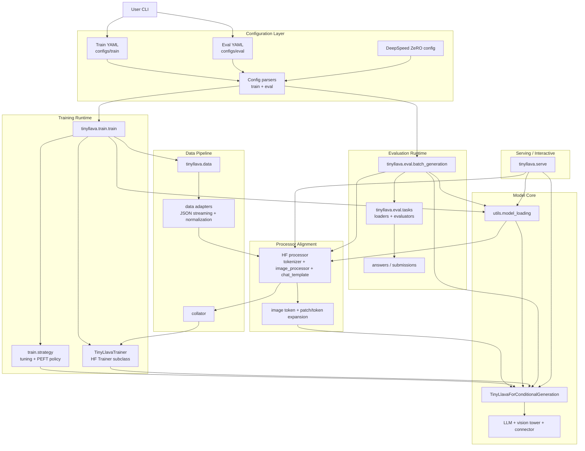
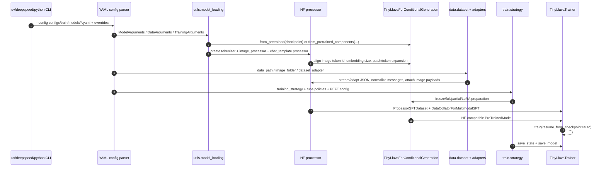
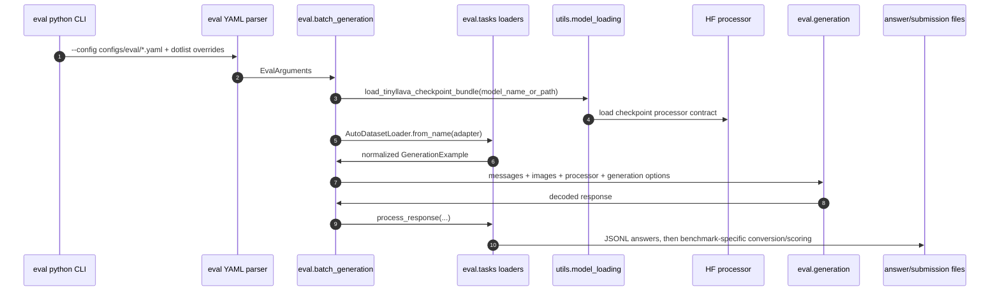
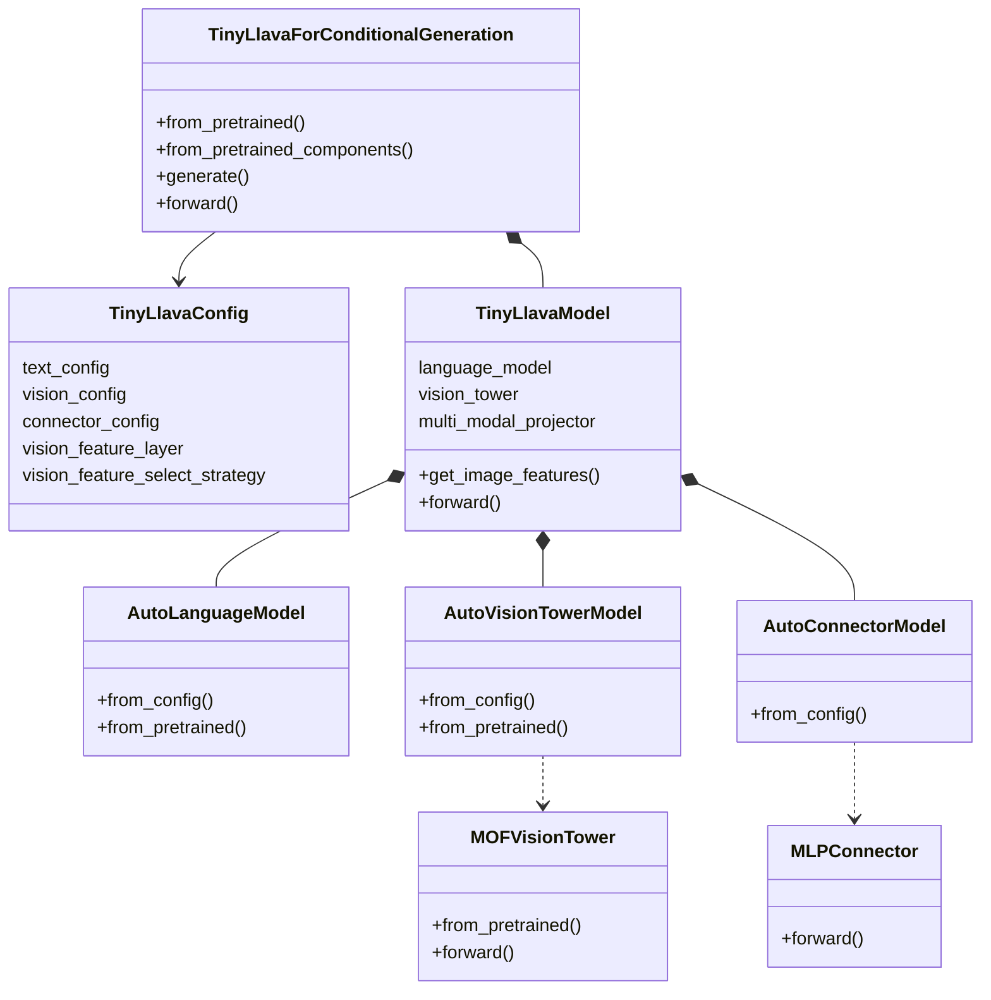
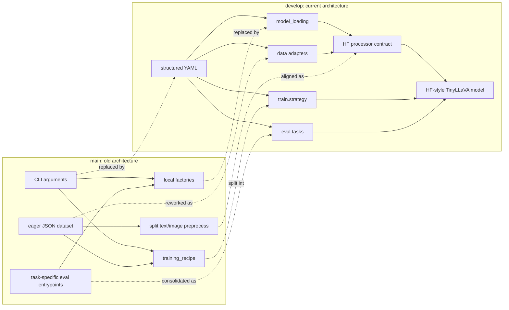

# TinyLLaVA Factory Architecture

This document describes the current `develop` branch architecture.

## Current `develop` Architecture

## Core Execution Paths

## Model Core

The important direction in `develop` is that TinyLLaVA now behaves like a
composite Hugging Face model. A complete TinyLLaVA checkpoint should load through
`TinyLlavaForConditionalGeneration.from_pretrained(...)`; fresh pretraining still
assembles language, vision, and connector components through
`from_pretrained_components(...)`.

## Processor Alignment

The processor boundary follows the direction introduced by `955f5d9` and
`ed74649`: TinyLLaVA should expose one Hugging Face processor contract instead of
asking callers to manually compose tokenizer, image processor, chat template,
image-token expansion, and assistant-label repair. Training data is normalized
into multimodal chat messages, image payloads are attached to those messages, and
the processor owns tokenization plus image preprocessing before the collator and
Trainer see the batch.

## `develop` vs `main`

| Area | `main` | `develop` |
| --- | --- | --- |
| Configuration | CLI flags parsed by `HfArgumentParser`; defaults are scattered across command invocations. | Structured YAML under `configs/train` and `configs/eval`, with OmegaConf dotlist overrides. |
| Model assembly | Instantiate empty `TinyLlavaForConditionalGeneration`, then call `load_llm`, `load_vision_tower`, `load_connector`. | Prefer HF loading: complete checkpoints through `from_pretrained`; fresh assembly through `from_pretrained_components`. |
| Component resolution | Project-local factories: `LLMFactory`, `VisionTowerFactory`, `ConnectorFactory`. | HF-style config/model mappings for composite model, vision tower, connector, and processor creation. |
| Training policy | `training_recipe` owns loading tweaks, tuning policy, and saving. | `train.strategy` owns tuning/PEFT policy; `utils.model_loading` owns loading; `utils.checkpoint` owns resume discovery. |
| Dataset path | JSON loaded eagerly by `LazySupervisedDataset`; text/image preprocessing split across legacy preprocessors/templates. | Hugging Face Dataset pipeline with streaming JSON-array reader, dataset adapters, normalized messages, assistant masks, processor-based encoding. |
| Processor contract | Tokenizer lived on the LLM side, image preprocessing lived on the vision side, and callers composed them manually. | `create_tinyllava_processor` builds the HF processor, injects TinyLLaVA chat-template anchors, aligns the image token, patch count, and vision feature strategy. |
| Trainer | Custom `LLaVATrainer`. | Thin `TinyLlavaTrainer` subclass over `transformers.Trainer`, adding optional modality-length grouping and using `processing_class=processor`. |
| Evaluation | Multiple task-specific generation entrypoints and conversion utilities. | Shared YAML-driven `batch_generation` plus `eval.tasks` loaders/evaluators; benchmark post-processing stays outside the core graph. |
| DeepSpeed/resume | Mostly delegated to runtime/trainer defaults. | Explicit DeepSpeed helper and checkpoint discovery integrated into training entrypoint. |

## Cleanup Notes

The current architecture still contains transitional files that are useful for
compatibility or not yet cleaned up. They should not be treated as anchors for
new work unless they are deliberately promoted back into the active design:

- `tinyllava/model/llm/gemma.py` and similar thin LLM wrappers: legacy registry
  remnants while language models increasingly rely on HF native classes.
- `tinyllava/model/connector/identity.py` and older connector modules:
  compatibility wrappers outside the active HF connector-config path.
- Local generated or scratch content such as `checkpoints/`, `eval_results/`,
  `test.py`, `test_elm.py`, and downloaded model weights under source paths.

For new functionality, prefer extending the active layers shown above:
YAML schema, `utils.model_loading`, `train.strategy`, `data.adapters`,
`eval.tasks`, or the HF-style auto mappings.
