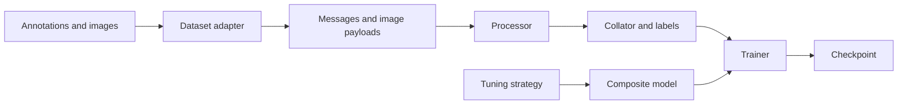

# Architecture

TinyLLaVA Factory separates model composition, input processing, training policy,
and evaluation. Training, batch evaluation, and interactive inference share
the model-loading and processor interfaces.

## Model components

`TinyLlavaConfig` describes three components:

- `text_config`: the language model.
- `vision_config`: the vision encoder.
- `connector_config`: the projection from visual features to language-model embeddings.

`TinyLlavaForConditionalGeneration` provides `forward` and `generate`.
Load a complete checkpoint with `from_pretrained`, or assemble initial
components with `from_pretrained_components`.

The processor combines the tokenizer, image processor, and chat template.
It aligns image placeholders with visual tokens and prepares model inputs.

## Training data flow

The adapter normalizes the dataset schema. The processor encodes text and
images, and the collator pads sequences and creates loss labels from assistant
masks. The tuning strategy selects trainable parameters and configures PEFT;
the Trainer handles optimization and checkpointing.

## Evaluation and inference

The checkpoint loader returns a model and its processor. Generation helpers
encode conversations, call the model, and decode responses. Evaluation tasks
provide input loaders and benchmark-specific scoring or export steps.

Use `tinyllava.eval.batch_generation` for datasets,
`tinyllava.eval.single_turn` for command-line inference, and
`tinyllava.serve.app` for the Web UI.

## Module responsibilities

| Module | Responsibility |
| --- | --- |
| `tinyllava.model` | Composite configuration, model, vision encoders, and connectors |
| `tinyllava.data` | Dataset adapters, processor creation, templates, and collator |
| `tinyllava.train` | Training entry point, tuning strategies, and sampling |
| `tinyllava.eval` | Generation, task loaders, and evaluators |
| `tinyllava.utils` | Arguments, configuration, checkpoint discovery, and loading |
| `tinyllava.serve` | Interactive Web UI |

See the [extension guide](guides/extending.md) and [API reference](reference/model.md)
for implementation details.
