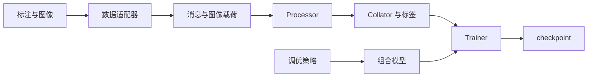

# 架构

TinyLLaVA Factory 将模型组合、输入处理、训练策略和评测分别组织为独立模块。训练、批量评测与交互推理共享模型加载和 processor 接口。

## 模型组件

`TinyLlavaConfig` 描述三个组件：

- `text_config`：语言模型。
- `vision_config`：视觉编码器。
- `connector_config`：将视觉特征映射到语言模型嵌入空间的连接器。

`TinyLlavaForConditionalGeneration` 提供 `forward` 和 `generate`。使用 `from_pretrained` 加载完整 checkpoint，或用 `from_pretrained_components` 组装初始组件。

processor 组合 tokenizer、image processor 与 chat template，负责对齐图像占位符与视觉 token，并准备模型输入。

## 训练数据流

adapter 统一数据格式，processor 编码文本与图像，collator 补齐序列并根据 assistant mask 创建损失标签。调优策略选择可训练参数并配置 PEFT，Trainer 负责优化过程和 checkpoint 保存。

## 评测与推理

checkpoint 加载器返回模型及其 processor。生成助手编码对话、调用模型并解码回答。评测任务提供输入加载器和对应的计分或导出步骤。

数据集评测使用 `tinyllava.eval.batch_generation`，命令行推理使用 `tinyllava.eval.single_turn`，Web UI 使用 `tinyllava.serve.app`。

## 模块职责

| 模块 | 职责 |
| --- | --- |
| `tinyllava.model` | 组合配置、模型、视觉编码器和连接器 |
| `tinyllava.data` | 数据适配器、processor 创建、模板与 collator |
| `tinyllava.train` | 训练入口、调优策略和采样 |
| `tinyllava.eval` | 生成、任务加载器与评测器 |
| `tinyllava.utils` | 参数、配置、checkpoint 发现和模型加载 |
| `tinyllava.serve` | 交互式 Web UI |

实现细节见[扩展指南](guides/extending.md)和[API 参考](reference/model.md)。
